ЛАБОРАТОРНА РОБОТА №4  
з дисципліни «Безпека програм та даних»

ТЕМА: Особистий цифровий підпис

Харківський національний економічний університет  
імені Семена Кузнеця  
Кафедра інформаційних систем

Виконав: студент 4 курсу  
групи 6.04.121.013.22.2  
факультету ІТ  
Виноградов Олег

Перевірив: Муржа Д. Ю.

м. Харків – 2025 рік
---------------------------------------------------------------------

МЕТА РОБОТИ

Метою лабораторної роботи є дослідження принципів роботи цифрового
підпису та створення власної системи підписання електронних документів
для забезпечення їх цілісності та автентичності.

---------------------------------------------------------------------

ЗАВДАННЯ РОБОТИ

1. Ознайомитися з поняттям цифрового підпису та його призначенням.
2. Дослідити процес формування хешу документа.
3. Згенерувати пару ключів для цифрового підпису.
4. Виконати підписання електронного документа.
5. Перевірити цифровий підпис та цілісність документа.
6. Перевірити поведінку системи при зміні підписаного файлу.
7. Реалізувати програмну частину мовою програмування C#.

---------------------------------------------------------------------

ТЕХНІЧНЕ ЗАВДАННЯ

Необхідно розробити консольний застосунок мовою програмування C#, який
дозволяє:

– генерувати приватний та публічний ключі на основі персональних даних;  
– формувати хеш електронного документа за допомогою алгоритму SHA-256;  
– створювати цифровий підпис документа;  
– перевіряти цифровий підпис та виявляти зміну документа;  
– забезпечувати контроль цілісності даних.

---------------------------------------------------------------------

ХІД ВИКОНАННЯ РОБОТИ

КРОК 1. Ознайомлення з принципами цифрового підпису

На першому етапі було вивчено теоретичні основи цифрового підпису.
Цифровий підпис базується на використанні криптографічних хеш-функцій
та асиметричних алгоритмів, які забезпечують цілісність та
автентичність електронних документів.

---------------------------------------------------------------------

КРОК 2. Генерація пари ключів

Було згенеровано пару ключів:
– приватний ключ, який використовується для створення підпису;
– публічний ключ, який використовується для перевірки підпису.

Ключі формувалися на основі персональних даних користувача з
використанням криптографічної хеш-функції.

**Рисунок 1.1 – Встановлення програми**

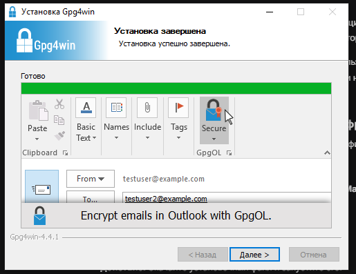

**Рисунок 1.2 – Запуск програми**

**Рисунок 1.3 – Початкове меню програми**

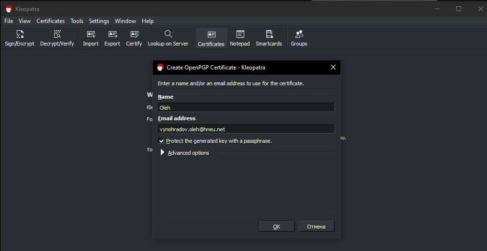

**Рисунок 1.4 – Ввід персональних даних**

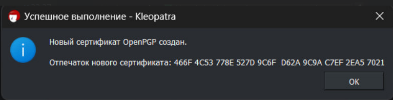

**Рисунок 1.5 – Формування параметрів ключів**

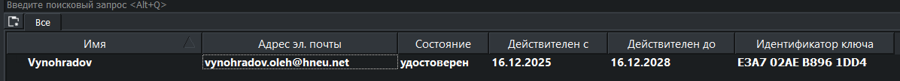

**Рисунок 1.6 – Генерація тестової пари ключів**

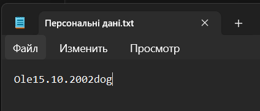

**Рисунок 1.7 – Відображення приватного та публічного ключів**

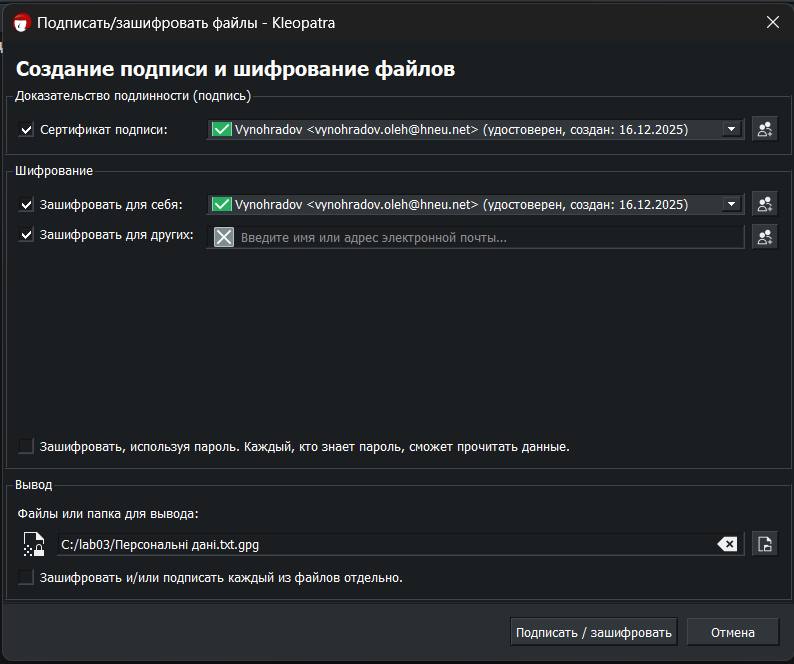

**Рисунок 1.8 – Створення текстового файлу**

**Рисунок 1.9 – Підписання текстового файлу**

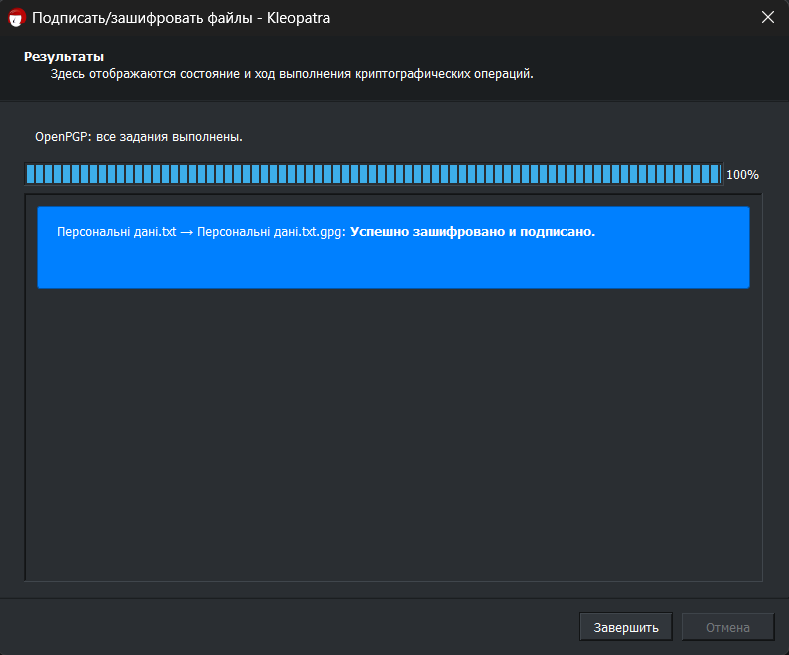

**Рисунок 1.10 – Збереження файлу підпису**

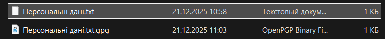

**Рисунок 1.11 – Перевірка цифрового підпису файлу**

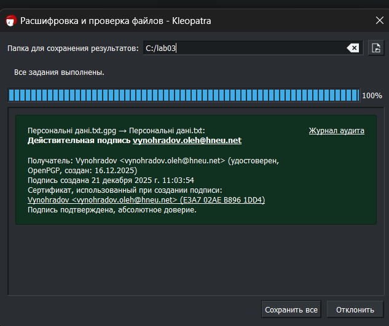

---------------------------------------------------------------------

КРОК 3. Створення та підписання документа

Для тестування було створено текстовий документ.
Для документа було:
1. Згенеровано хеш за алгоритмом SHA-256.
2. Хеш підписано приватним ключем.
3. Цифровий підпис збережено в окремому файлі.
   
**Рисунок 2.1 – Підготовка до генерації ключів**

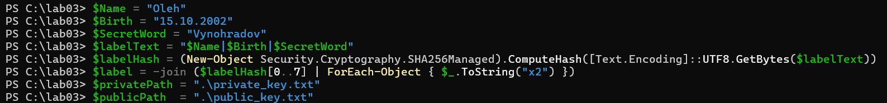

**Рисунок 2.2 – Створення ключів**

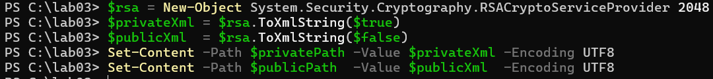

**Рисунок 2.3 – Процес генерації ключів**

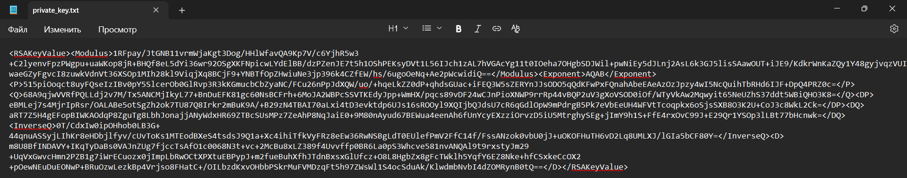

**Рисунок 2.4 – Згенеровані ключі**

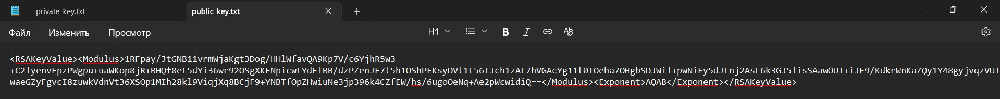

---------------------------------------------------------------------

КРОК 4. Перевірка цифрового підпису

Було виконано перевірку цифрового підпису з використанням публічного
ключа. Перевірка підтвердила цілісність документа та справжність
підпису.

**Рисунок 3.1 – Хеш документу**

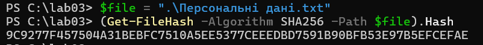

**Рисунок 3.2 – Підпис файлу**

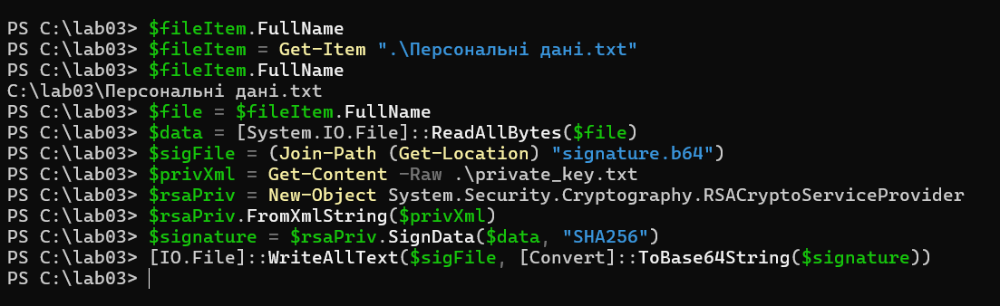

**Рисунок 3.3 – Збережений файл підпису**

**Рисунок 3.4 – Перевірка цифрового підпису**

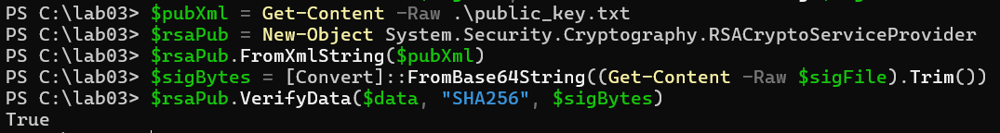

---------------------------------------------------------------------

КРОК 5. Перевірка стійкості до змін

Було внесено зміни до підписаного документа та повторно виконано
перевірку цифрового підпису. У результаті перевірки система
коректно виявила зміну файлу та відхилила підпис.

**Рисунок 3.5 – Модифікований файл**

**Рисунок 3.6 – Перевірка цифрового підпису**

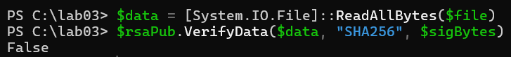

**Рисунок 3.7 – Спроба підробки та результат перевірки**

---------------------------------------------------------------------

ПРОГРАМНА РЕАЛІЗАЦІЯ

У межах лабораторної роботи було реалізовано консольний застосунок
мовою програмування C#, який забезпечує:

– генерацію ключів;  
– підписання електронних документів;  
– перевірку цифрового підпису;  
– контроль цілісності даних.

Програма має меню керування та дозволяє послідовно виконувати всі
етапи роботи з цифровим підписом.

**Рисунок 4.1 – Головне меню програми**

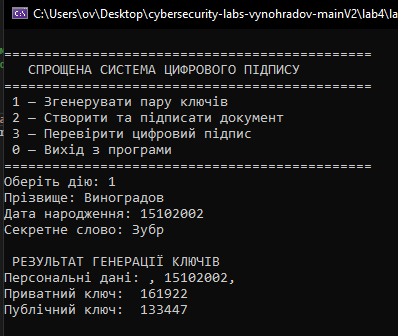

**Рисунок 4.2 – Генерація пари ключів**

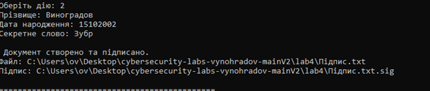

**Рисунок 4.3 – Збереження підписаного файлу та підпису**

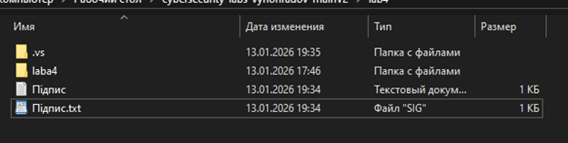

**Рисунок 4.4 – Успішна перевірка цифрового підпису**

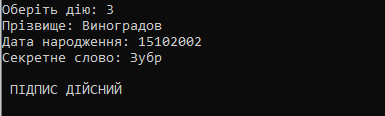

**Рисунок 4.5 – Помилка перевірки підпису після зміни файлу**

---------------------------------------------------------------------

ВИСНОВКИ

У ході виконання лабораторної роботи було досліджено принципи роботи
цифрового підпису та реалізовано власну систему підписання та перевірки
електронних документів. Експериментально підтверджено, що будь-яка
зміна підписаного файлу призводить до втрати дійсності підпису, що
забезпечує надійний контроль цілісності та автентичності даних.
