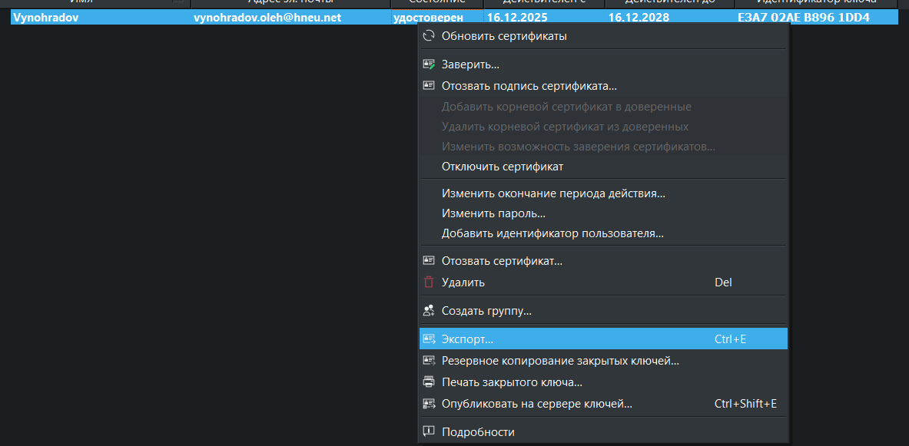
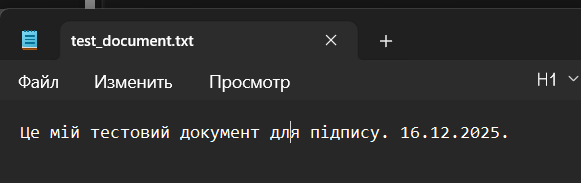
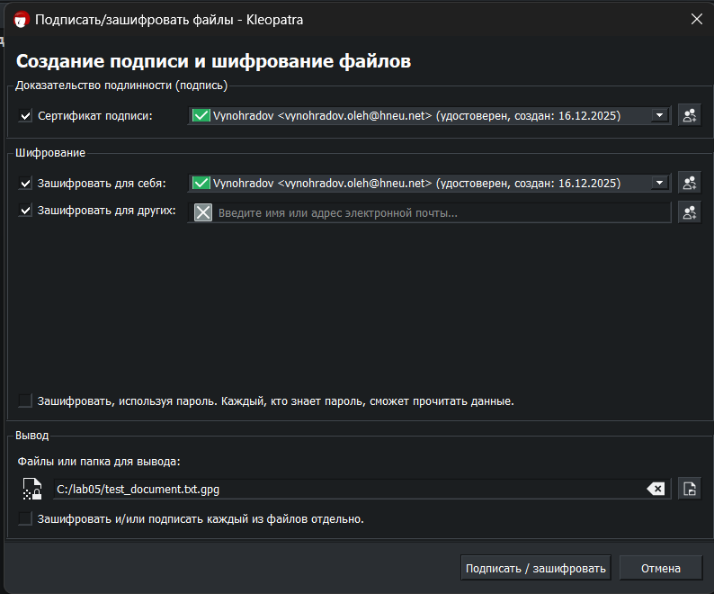
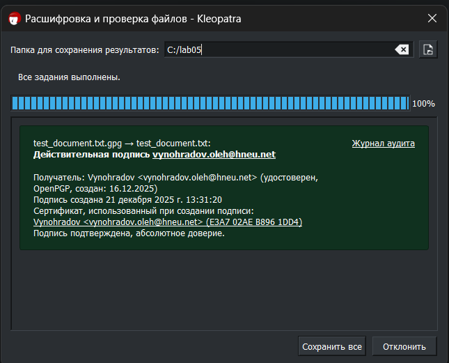
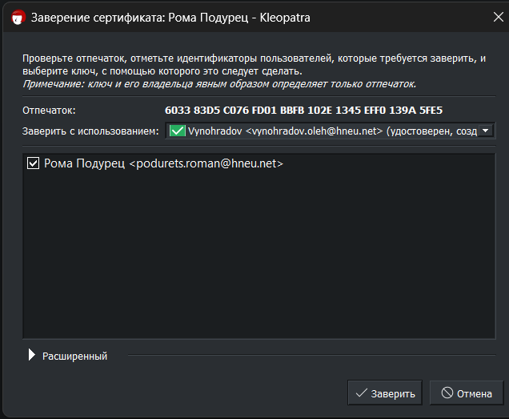
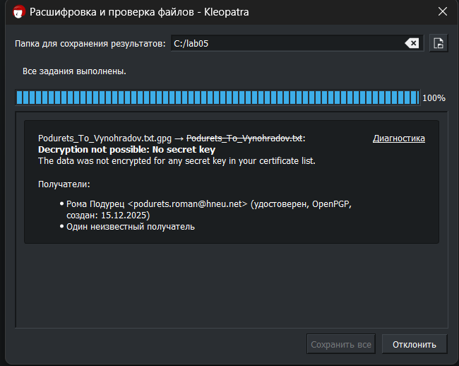
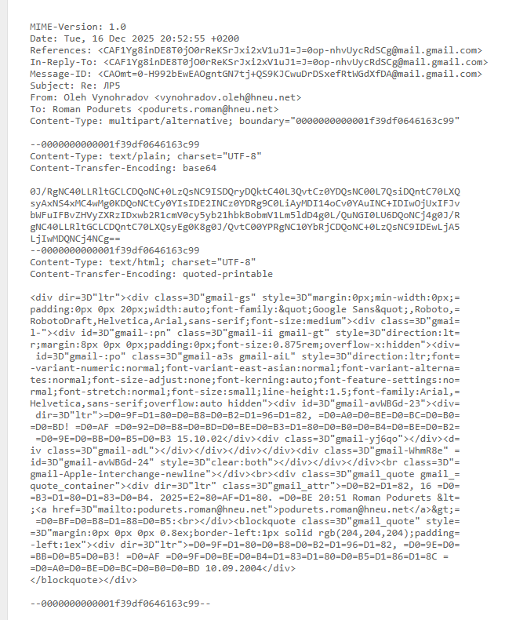
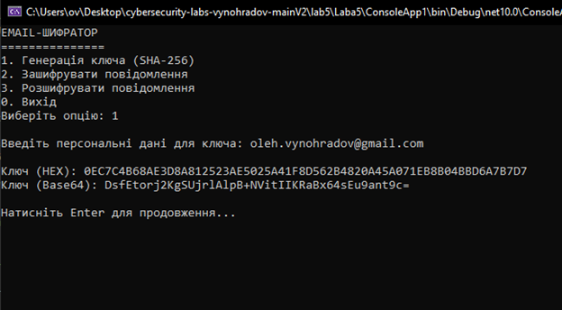
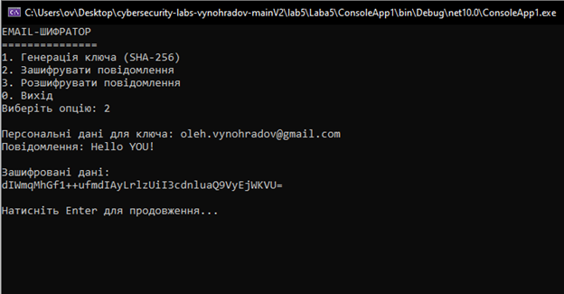
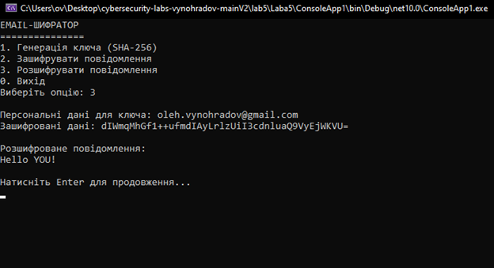

ЛАБОРАТОРНА РОБОТА №5  
з дисципліни «Безпека програм та даних»

ТЕМА: Захищена електронна пошта

Харківський національний економічний університет  
імені Семена Кузнеця  
Кафедра інформаційних систем

Виконав: студент 4 курсу  
групи 6.04.121.013.22.2  
факультету ІТ  
Виноградов Олег

Перевірив: Муржа Д. Ю.

м. Харків – 2025 рік
---------------------------------------------------------------------

МЕТА РОБОТИ

Метою лабораторної роботи є дослідження методів захисту електронної
кореспонденції, ознайомлення з принципами роботи PGP-шифрування та
реалізація захищеного обміну електронними повідомленнями.

---------------------------------------------------------------------

ЗАВДАННЯ РОБОТИ

1. Ознайомитися з принципами захисту електронної пошти.
2. Дослідити алгоритм PGP-шифрування та цифрового підпису.
3. Згенерувати пару криптографічних ключів для електронної пошти.
4. Виконати експорт та імпорт публічних ключів.
5. Зашифрувати електронне повідомлення для іншого користувача.
6. Виконати спробу розшифрування отриманого повідомлення.
7. Проаналізувати рівень безпеки захищеної електронної кореспонденції.

---------------------------------------------------------------------

ТЕХНІЧНЕ ЗАВДАННЯ

Необхідно використати програмне забезпечення для роботи з PGP, яке
дозволяє:

– генерувати пару криптографічних ключів;  
– експортувати та імпортувати публічні ключі;  
– виконувати шифрування та підпис електронних повідомлень;  
– перевіряти можливість розшифрування зашифрованих даних;  
– аналізувати безпеку електронної пошти.

---------------------------------------------------------------------

ХІД ВИКОНАННЯ РОБОТИ

КРОК 1. Ознайомлення з принципами захищеної електронної пошти

На першому етапі було вивчено основні загрози безпеці електронної
кореспонденції та принципи використання PGP-шифрування для забезпечення
конфіденційності, цілісності та автентичності повідомлень.

---------------------------------------------------------------------

КРОК 2. Генерація PGP-ключів

Було згенеровано пару криптографічних ключів:
– публічний ключ для шифрування повідомлень;
– приватний ключ для розшифрування та створення цифрового підпису.

Ключі використовуються для захищеного обміну електронними повідомленнями.

**Рис. 1.1 – Згенеровані PGP-ключі**

**Рис. 1.2 – 1.3 – Експорт публічного ключа**

**Рис. 1.4 – 1.5 – Створений текстовий файл для обміну**

**Рис. 1.6 – 1.7 – Підпис та перевірка підпису**

---------------------------------------------------------------------

КРОК 3. Експорт та імпорт публічного ключа

Публічний ключ було експортовано та передано іншому користувачу.
Також було виконано імпорт публічного ключа іншого користувача для
подальшого шифрування повідомлень.

**Рис. 2.1 – 2.3 – Імпорт публічного ключа іншого користувача**

**Рис. 2.4 – Відправлений зашифрований файл**

**Рис. 2.5 – Спроба розшифрувати повідомлення**

---------------------------------------------------------------------

КРОК 4. Шифрування електронного повідомлення

Було створено текстове повідомлення, яке зашифровано з використанням
публічного ключа отримувача. Зашифроване повідомлення підготовлено для
передачі електронною поштою.

**Рис. 3.1 – Заголовок звичайного електронного листа**

**Рис. 3.2 – Заголовок зашифрованого електронного листа**

---------------------------------------------------------------------

КРОК 5. Спроба розшифрування повідомлення

Було виконано спробу розшифрування отриманого зашифрованого повідомлення.
У результаті повідомлення не вдалося розшифрувати, що підтверджує
надійність захисту та коректність використання криптографічних ключів.

---------------------------------------------------------------------

ПРОГРАМНА РЕАЛІЗАЦІЯ

У межах лабораторної роботи використовувалося програмне забезпечення
для роботи з PGP, яке дозволяє виконувати всі етапи захищеного обміну
електронними повідомленнями, включаючи генерацію ключів, шифрування,
підпис та перевірку повідомлень.

**Рис. 4.1 – Генерація криптографічного ключа**

**Рис. 4.2 – Шифрування повідомлення**

**Рис. 4.3 – Розшифрування повідомлення**

---------------------------------------------------------------------

ВИСНОВКИ

У ході виконання лабораторної роботи було досліджено принципи захисту
електронної пошти за допомогою PGP-шифрування. Отримані результати
показали, що використання криптографічних ключів забезпечує високий
рівень конфіденційності та унеможливлює несанкціонований доступ до
електронної кореспонденції.
