Лабораторна робота 6
з дисципліни «Безпека програм та даних»

ТЕМА: Етичний хакінг власного застосунку (SQL-ін?єкції)

Харківський національний економічний університет  
імені Семена Кузнеця  
Кафедра інформаційних систем

Виконав: студент 4 курсу  
групи 6.04.121.013.22.2  
факультету ІТ  
Виноградов Олег

Перевірив: Муржа Д. Ю.

м. Харків – 2025 рік
---------------------------------------------------------------------

МЕТА РОБОТИ

Метою лабораторної роботи є вивчення принципів SQL-ін?єкцій, аналіз
уразливостей програмних застосунків та набуття практичних навичок
виявлення і усунення SQL-ін?єкцій на прикладі власного програмного
застосунку.

---------------------------------------------------------------------

ЗАВДАННЯ РОБОТИ

1. Ознайомитися з поняттям SQL-ін?єкції та механізмом її роботи.
2. Дослідити приклади SQL-ін?єкцій на спеціалізованих навчальних платформах.
3. Проаналізувати уразливі та захищені SQL-запити.
4. Реалізувати вразливу авторизацію у власному застосунку.
5. Реалізувати захищену авторизацію з використанням параметризованих запитів.
6. Порівняти результати роботи вразливої та захищеної версій.
7. Зробити висновки щодо методів захисту від SQL-ін?єкцій.

---------------------------------------------------------------------

ТЕХНІЧНЕ ЗАВДАННЯ

Необхідно розробити консольний застосунок мовою програмування C#, який
дозволяє:

– автоматично створювати базу даних та таблицю користувачів;  
– виконувати заповнення таблиці тестовими даними;  
– реалізувати вразливу авторизацію з використанням динамічних SQL-запитів;  
– реалізувати захищену авторизацію з параметризованими SQL-запитами;  
– демонструвати різницю між захищеним та незахищеним підходами.

---------------------------------------------------------------------

ХІД ВИКОНАННЯ РОБОТИ

## КРОК 1. Ознайомлення з принципами SQL-інʼєкцій

На першому етапі було вивчено теоретичні основи SQL-інʼєкцій, принципи
впливу користувацького вводу на SQL-запити та наслідки використання
незахищених запитів у програмних застосунках.

**Рис. 1.1 – Веб сервіс PortSwigger**

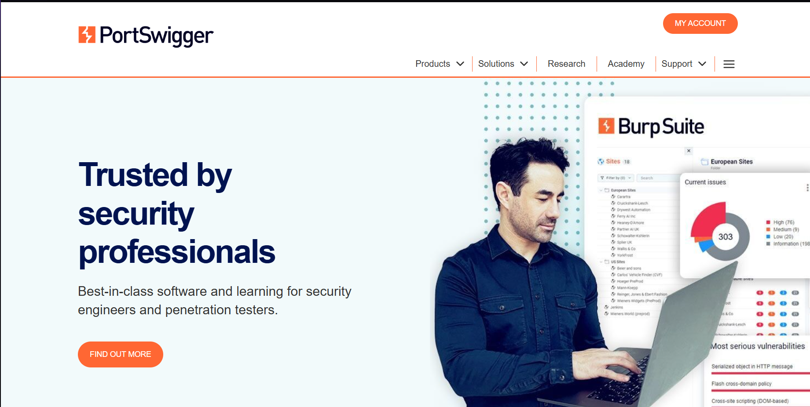

**Рис. 1.2 – 1.4 – Процес реєстрації на веб сервісі PortSwigger**

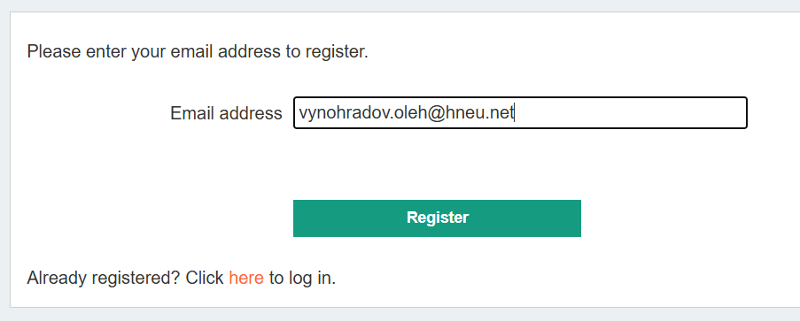
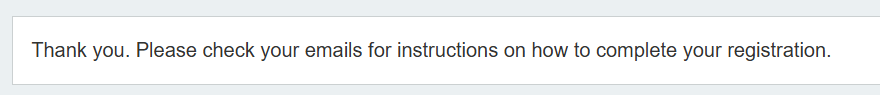
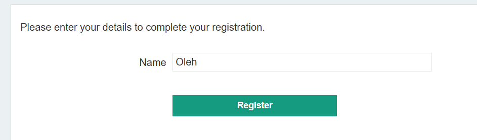

**Рис. 1.5 – 1.6 – Проходження першої лабораторної**

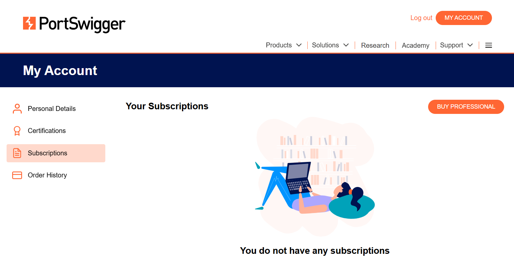
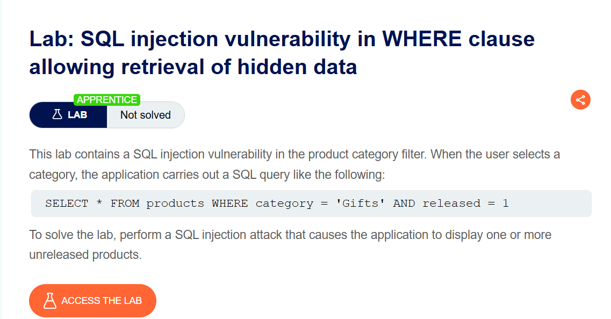

**Рис. 1.7 – 1.9 – Проходження другої лабораторної**

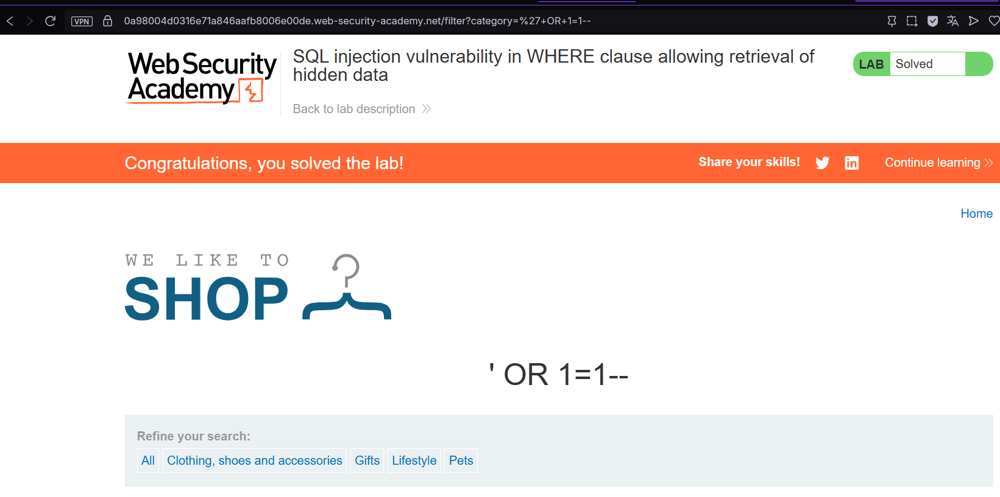
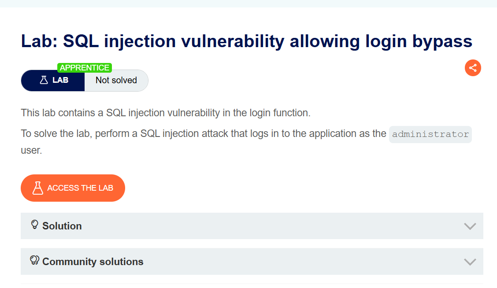

**Рис. 1.10 – 1.11 – Спроби атаки на вебсервіс PortSwigger**

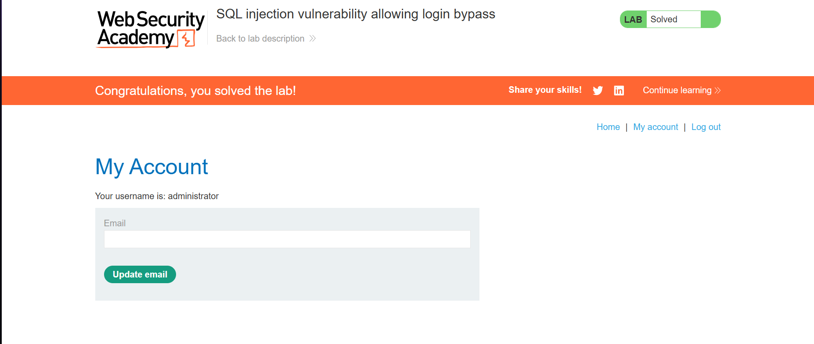
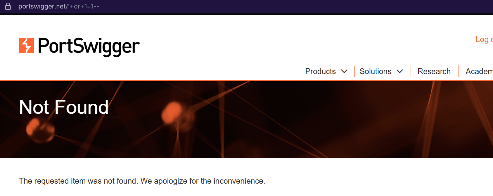

---------------------------------------------------------------------

## КРОК 2. Аналіз уразливих та захищених SQL-запитів

Було проаналізовано приклади уразливих SQL-запитів, у яких користувацький
ввід напряму підставляється в SQL-код, а також їх безпечні аналоги з
використанням параметризованих запитів.

**Рис. 2.1 – Скріншот порівняння запитів**

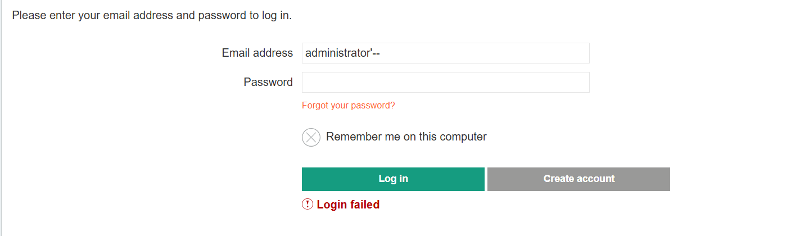

---------------------------------------------------------------------

## КРОК 3. Тестування SQL-інʼєкцій на практиці

Було виконано тестування прикладу інʼєкції на практиці та перевірено
поведінку “Fixed” версії.

**Рис. 3.1 – Обрана задача**

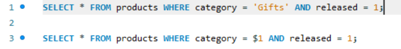

**Рис. 3.2 – Спроба повторити на Fixed версії**

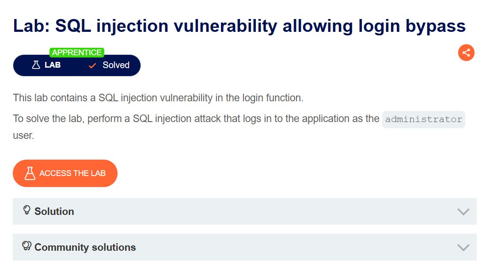

---------------------------------------------------------------------

## ТЕХНІЧНЕ ЗАВДАННЯ (ПРОГРАМНА РЕАЛІЗАЦІЯ)

У межах лабораторної роботи було реалізовано консольний застосунок мовою
програмування C# з використанням бази даних SQLite. Програма автоматично
створює БД та таблицю користувачів, заповнює її тестовими даними, а також
демонструє роботу вразливої та захищеної авторизації.

**Рис. 4.2 – Усі користувачі у системі для наглядності**

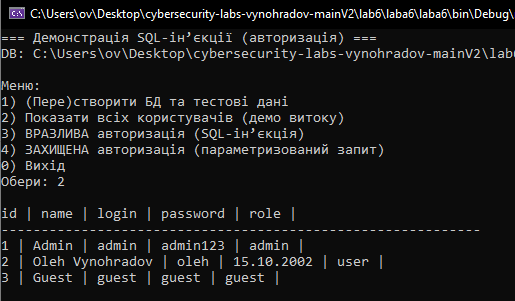

**Рис. 4.3 – Вразлива авторизація із не правильним паролем**

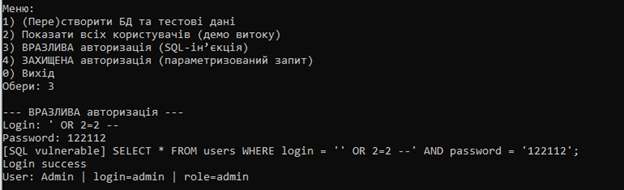

**Рис. 4.4 – Захищенна авторизація**

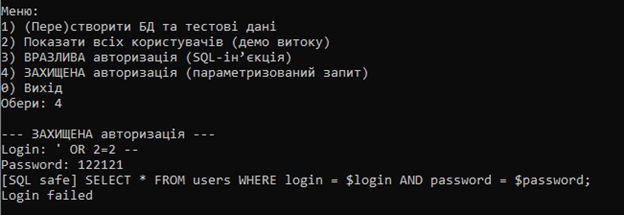

---------------------------------------------- -----------------------

ВИСНОВКИ

У ході виконання лабораторної роботи було досліджено механізм SQL-ін?єкцій
та на практиці продемонстровано небезпеку використання незахищених
SQL-запитів. Реалізація параметризованих запитів підтвердила свою
ефективність у захисті програмних застосунків від SQL-ін?єкцій та
забезпеченні безпеки доступу до даних.
